# Spans - すれ違いSNS ガイド

> **最終更新**: 2025-10-10
> **目的**: 実装レベルの完全な仕様定義（図解付き）

---

## 📋 目次

1. [システム全体像](https://www.notion.so/Spans-StreetPAss-sNS-26f5e309a9d680f9994ec7ff4a405cee?pvs=21)
2. [認証機能](https://www.notion.so/Spans-StreetPAss-sNS-26f5e309a9d680f9994ec7ff4a405cee?pvs=21)
3. [すれ違い検出機能](https://www.notion.so/Spans-StreetPAss-sNS-26f5e309a9d680f9994ec7ff4a405cee?pvs=21)
4. [タイムライン機能](https://www.notion.so/Spans-StreetPAss-sNS-26f5e309a9d680f9994ec7ff4a405cee?pvs=21)
5. [投稿機能](https://www.notion.so/Spans-StreetPAss-sNS-26f5e309a9d680f9994ec7ff4a405cee?pvs=21)
6. [いいね機能](https://www.notion.so/Spans-StreetPAss-sNS-26f5e309a9d680f9994ec7ff4a405cee?pvs=21)
7. [検索機能](https://www.notion.so/Spans-StreetPAss-sNS-26f5e309a9d680f9994ec7ff4a405cee?pvs=21)
8. [プロフィール機能](https://www.notion.so/Spans-StreetPAss-sNS-26f5e309a9d680f9994ec7ff4a405cee?pvs=21)
9. [データベース設計](https://www.notion.so/Spans-StreetPAss-sNS-26f5e309a9d680f9994ec7ff4a405cee?pvs=21)
10. [アーキテクチャ設計](https://www.notion.so/Spans-StreetPAss-sNS-26f5e309a9d680f9994ec7ff4a405cee?pvs=21)
11. [定数・エラーコード](https://www.notion.so/Spans-StreetPAss-sNS-26f5e309a9d680f9994ec7ff4a405cee?pvs=21)
12. [API仕様](https://www.notion.so/Spans-StreetPAss-sNS-26f5e309a9d680f9994ec7ff4a405cee?pvs=21)

---

## 1. システム全体像

### 1.1 コンセプト

物理的にすれ違った人の投稿のみが閲覧できる、時間制限付きSNS

### 1.2 コア機能

- すれ違い検出（BLE使用、約10m範囲）
- 時間制限付き閲覧（すれ違い時刻以前の投稿のみ）
- 投稿機能（テキスト・画像・動画、256文字制限）
- いいね、検索、プロフィール管理

### 1.3 全体ユースケース図


### 1.4 画面遷移図


---

## 2. 認証機能

### 2.1 ユースケース一覧

| UC ID | 名称 | 説明 |
| --- | --- | --- |
| UC-AUTH-001 | Google認証ログイン | Google OAuthでログイン |
| UC-AUTH-002 | 初回プロフィール設定 | ニックネーム・アバター設定 |
| UC-AUTH-003 | 自動ログイン | セッション確認 |

### 2.2 Google認証シーケンス図


### 2.3 UC-AUTH-001: SignInWithGoogleUseCase

**責務**: Google認証を実行し、セッションを保存

**入力**: なし

**出力**: `Result<User>`

**処理フロー**:

1. Google Sign-In SDKでID Token取得
2. SupabaseにPOST /auth/google
3. レスポンスからuser, session取得
4. セッションをローカルに暗号化保存
5. ユーザー情報をRoom DBに保存
6. 新規ユーザーフラグ確認
7. Userを返却

**エラーケース**:

- GoogleAuthCancelled → エラー表示なし
- GoogleAuthFailed → "Google認証に失敗しました"
- NetworkError → "ネットワークエラー"
- ServerAuthFailed → "認証に失敗しました"

---

## 3. すれ違い検出機能

### 3.1 ユースケース一覧

| UC ID | 名称 | 説明 |
| --- | --- | --- |
| UC-BLE-001 | BLE検出開始 | アプリ起動時に開始 |
| UC-BLE-002 | すれ違い検出 | 周囲のUUID検出 |
| UC-BLE-003 | サーバー同期 | 5分ごとに同期 |

### 3.2 BLE検出フロー


### 3.3 すれ違い検出シーケンス図


### 3.4 UC-BLE-002: DetectEncounterUseCase

**責務**: 検出したUUIDとRSSIからすれ違いを記録

**入力**:

- `uuid: String`
- `rssi: Int`

**出力**: `Result<Encounter?>`

**処理フロー**:

1. RSSI閾値チェック（-90dBm未満は無視）
2. 既存データ取得
3. 重複チェック（5分以内は無視）
4. データ作成/更新
    - 新規: 新しいEncounter作成
    - 既存: lastSeen, encounterCount更新
5. 平均RSSI計算
6. Room DB保存（synced=false）
7. 新規の場合は通知スケジュール

---

## 4. タイムライン機能

### 4.1 ユースケース一覧

| UC ID | 名称 | 説明 |
| --- | --- | --- |
| UC-TL-001 | タイムライン表示 | すれ違った人の投稿表示 |
| UC-TL-002 | 追加読み込み | スクロールで追加取得 |
| UC-TL-003 | Pull-to-Refresh | 最新投稿取得 |

### 4.2 タイムライン取得シーケンス図


### 4.3 UC-TL-001: GetTimelineUseCase

**責務**: すれ違ったユーザーの投稿を時刻フィルタリングして取得

**入力**:

- `offset: Int = 0`
- `forceRefresh: Boolean = false`

**出力**: `Result<List<Post>>`

**処理フロー**:

1. すれ違い情報取得
2. 空チェック（すれ違いなし→空リスト）
3. リクエスト構築（UUIDs + Timestamps）
4. キャッシュ確認（forceRefresh=falseの場合）
5. サーバー取得
6. キャッシュ保存
7. 結果返却

**時刻フィルタリング**:

```sql
SELECT * FROM posts
WHERE author_uuid IN (uuid1, uuid2, ...)
  AND created_at <= CASE author_uuid
    WHEN uuid1 THEN timestamp1
    WHEN uuid2 THEN timestamp2
  END
ORDER BY created_at DESC
LIMIT 20 OFFSET 0

```

---

## 5. 投稿機能

### 5.1 ユースケース一覧

| UC ID | 名称 | 説明 |
| --- | --- | --- |
| UC-POST-001 | 投稿作成 | テキスト・メディア投稿 |
| UC-POST-002 | 投稿編集 | テキスト編集 |
| UC-POST-003 | 投稿削除 | 論理削除 |

### 5.2 投稿作成シーケンス図

```mermaid
sequenceDiagram
    actor User
    participant UI as PostCreateScreen
    participant VM as ViewModel
    participant UC as CreatePostUseCase
    participant Storage as StorageRepository
    participant PostRepo as PostRepository
    participant API as Supabase

    User->>UI: テキスト入力
    User->>UI: 画像選択
    User->>UI: 投稿ボタン
    UI->>VM: onIntent(Submit)
    VM->>UC: invoke(content, mediaFile)

    alt メディアあり
        UC->>UC: compressImage(85%, 1920x1920)
        UC->>Storage: uploadImage()
        Storage->>API: POST /storage/posts
        API-->>Storage: {url}
        Storage-->>UC: mediaUrl
    end

    UC->>PostRepo: createPost(content, mediaUrl)
    PostRepo->>API: POST /api/posts
    API-->>PostRepo: {post}
    PostRepo-->>UC: Result.Success(post)
    UC-->>VM: Result.Success(post)
    VM-->>UI: Effect: NavigateBack
    UI-->>User: タイムライン画面へ

```



### 5.3 UC-POST-001: CreatePostUseCase

**責務**: 投稿を作成し、メディアがあればアップロード

**入力**:

- `content: String` (1-256文字)
- `mediaFile: File?`

**出力**: `Result<Post>`

**処理フロー**:

1. バリデーション（文字数・ファイルサイズ）
2. メディア処理（ある場合）
    - 画像圧縮（JPEG 85%、1920x1920px）
    - EXIF削除
    - サムネイル生成（300x300px）
    - Storageアップロード
3. 投稿作成（POST /api/posts）
4. キャッシュ更新
5. 結果返却

---

## 6. いいね機能

### 6.1 ユースケース一覧

| UC ID | 名称 | 説明 |
| --- | --- | --- |
| UC-LIKE-001 | いいね追加/削除 | 楽観的UI更新 |

### 6.2 いいね処理シーケンス図


### 6.3 UC-LIKE-001: LikePostUseCase

**責務**: いいねを追加/削除（楽観的UI更新）

**入力**: `postId: String`

**出力**: `Result<Int>`

**処理フロー**:

1. ローカル確認（いいね済みか）
2. ローカル更新（Room DBに即座反映）
3. サーバー送信（バックグラウンド）
4. エラー時ロールバック

---

## 7. 検索機能

### 7.1 ユースケース一覧

| UC ID | 名称 | 説明 |
| --- | --- | --- |
| UC-SEARCH-001 | ユーザー検索 | すれ違ったユーザーを検索 |
| UC-SEARCH-002 | 投稿検索 | すれ違ったユーザーの投稿を検索 |

### 7.2 検索シーケンス図


### 7.3 UC-SEARCH-001: SearchUsersUseCase

**責務**: すれ違ったユーザーをニックネームで検索

**入力**: `query: String`

**出力**: `Result<List<User>>`

**処理フロー**:

1. すれ違い情報取得
2. UUID抽出
3. ユーザー検索（APIで部分一致）
4. エンリッチ（すれ違い回数付与）
5. ソート（すれ違い回数降順）
6. 結果返却

---

## 8. プロフィール機能

### 8.1 ユースケース一覧

| UC ID | 名称 | 説明 |
| --- | --- | --- |
| UC-PROFILE-001 | プロフィール表示 | 自分/他人のプロフィール |
| UC-PROFILE-002 | プロフィール編集 | ニックネーム・アバター更新 |
| UC-PROFILE-003 | ブロック | ユーザーブロック |

### 8.2 プロフィール取得シーケンス図


### 8.3 UC-PROFILE-002: UpdateProfileUseCase

**責務**: プロフィール更新

**入力**:

- `nickname: String`
- `bio: String?`
- `avatarFile: File?`

**出力**: `Result<User>`

**処理フロー**:

1. バリデーション（ニックネーム2-20文字）
2. アバターアップロード（変更時）
    - 圧縮（512x512、JPEG 85%）
    - POST /storage/avatars
3. API更新（PUT /api/profile）
4. ローカル更新（Room DB）
5. 結果返却

---

## 9. データベース設計

### 9.1 Supabase PostgreSQL ER図


### 9.2 Room Database テーブル

| テーブル | 説明 |
| --- | --- |
| encounter_entity | すれ違い情報（uuid, last_seen, count, rssi, synced） |
| post_cache_entity | 投稿キャッシュ（id, content, like_count, cached_at） |
| user_cache_entity | ユーザーキャッシュ（uuid, nickname, avatar_url） |
| like_cache_entity | いいねキャッシュ（user_uuid, post_id） |
| session_entity | セッション（access_token, refresh_token, expires_at） |

---

## 10. アーキテクチャ設計

### 10.1 MVI データフロー


### 10.2 レイヤー構成

```
Presentation Layer (UI, ViewModel, UiState/Intent/Effect)
       ↓
Domain Layer (UseCase, Model, Repository Interface)
       ↓
Data Layer (Repository Impl, Remote, Local)

```

---

## 11. 定数・エラーコード

### 11.1 BLE定数

| 定数 | 値 | 説明 |
| --- | --- | --- |
| RSSI_THRESHOLD | -90 dBm | 検出可能最小電波強度 |
| DUPLICATE_THRESHOLD | 5分 | 重複判定時間 |
| SCAN_INTERVAL_FOREGROUND | 60秒 | フォアグラウンドスキャン間隔 |
| SCAN_INTERVAL_BACKGROUND | 300秒 | バックグラウンドスキャン間隔 |

### 11.2 投稿定数

| 定数 | 値 | 説明 |
| --- | --- | --- |
| MIN_CONTENT_LENGTH | 1 | 最小文字数 |
| MAX_CONTENT_LENGTH | 256 | 最大文字数 |
| MAX_IMAGE_SIZE | 10MB | 画像最大サイズ |
| MAX_VIDEO_SIZE | 50MB | 動画最大サイズ |
| IMAGE_QUALITY | 85% | JPEG圧縮品質 |

### 11.3 エラーコード

| コード | メッセージ |
| --- | --- |
| AUTH_GOOGLE_FAILED | Google認証に失敗しました |
| BLE_PERMISSION_DENIED | Bluetooth権限を許可してください |
| NETWORK_ERROR | 通信エラーが発生しました |
| NOT_ENCOUNTERED | このユーザーとはまだすれ違っていません |
| VALIDATION_CONTENT | 投稿は1-256文字で入力してください |

---

## 12. API仕様

### 12.1 認証API

| メソッド | エンドポイント | 説明 |
| --- | --- | --- |
| POST | /auth/google | Google OAuth認証 |
| POST | /auth/refresh | トークン更新 |

### 12.2 投稿API

| メソッド | エンドポイント | 説明 |
| --- | --- | --- |
| POST | /api/posts | 投稿作成 |
| GET | /api/posts/:id | 投稿取得 |
| PUT | /api/posts/:id | 投稿編集 |
| DELETE | /api/posts/:id | 投稿削除 |

### 12.3 タイムラインAPI

| メソッド | エンドポイント | 説明 |
| --- | --- | --- |
| POST | /api/timeline | タイムライン取得 |

**リクエスト**:

```json
{
  "encounterUuids": ["uuid1", "uuid2"],
  "encounterTimestamps": {
    "uuid1": 1234567890,
    "uuid2": 1234567891
  },
  "limit": 20,
  "offset": 0
}

```

**レスポンス**:

```json
{
  "posts": [...],
  "hasMore": true
}

```

### 12.4 いいねAPI

| メソッド | エンドポイント | 説明 |
| --- | --- | --- |
| POST | /api/likes | いいね追加 |
| DELETE | /api/likes/:postId | いいね削除 |

### 12.5 すれ違いAPI

| メソッド | エンドポイント | 説明 |
| --- | --- | --- |
| POST | /api/encounters/sync | すれ違い情報同期 |

---

##